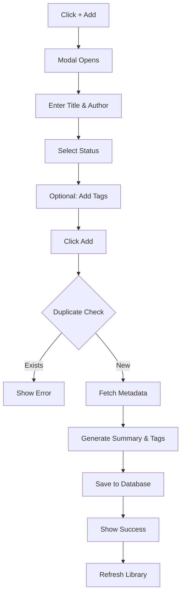
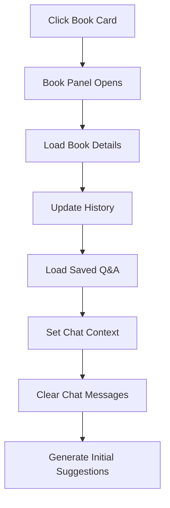
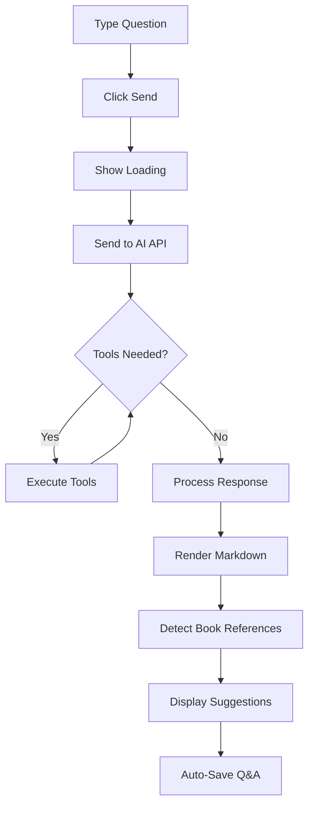
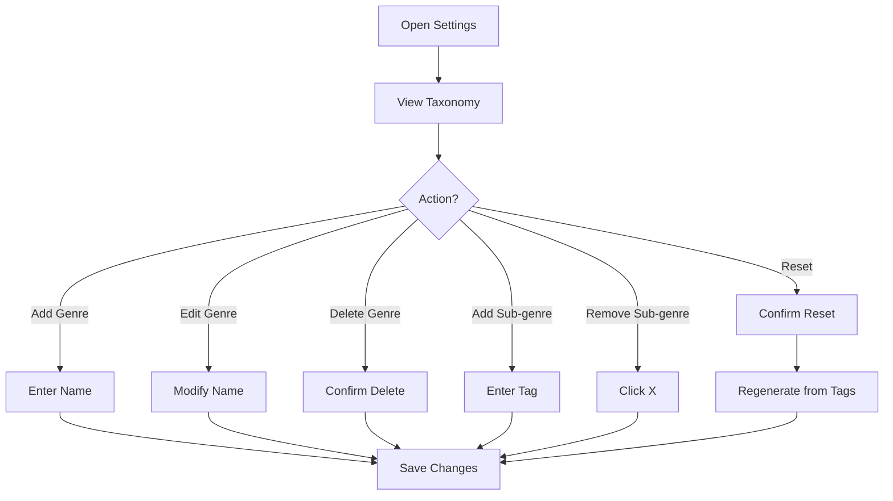

# AI Library Manager - Features Specification

> A comprehensive specification for building and testing the AI Library Manager application.
> Version: 1.0 | Last Updated: January 2025

---

## Table of Contents

1. [Executive Summary](#1-executive-summary)
2. [Technology Stack](#2-technology-stack)
3. [Data Models](#3-data-models)
4. [API Specification](#4-api-specification)
5. [User Interface](#5-user-interface)
6. [Core Features](#6-core-features)
7. [AI Integration](#7-ai-integration)
8. [User Workflows](#8-user-workflows)
9. [State Management](#9-state-management)
10. [Validation & Error Handling](#10-validation--error-handling)
11. [Test Scenarios](#11-test-scenarios)

---

## 1. Executive Summary

### Purpose
AI Library Manager is a personal book management system that combines traditional library functionality with AI-powered conversational assistance. Users can manage their book collections, track reading progress, take notes, and engage in intelligent conversations about their books using Claude AI.

### Key Capabilities
- **Book Management**: Add, edit, delete, search, and filter books
- **Reading Tracking**: Track status (want-to-read, reading, completed, on-hold), progress, dates, and ratings
- **Notes System**: Create notes, highlights, and quotes with optional page references
- **AI Q&A**: Ask questions about specific books or your entire library
- **Genre Taxonomy**: Organize books with auto-generated or custom genre hierarchies
- **Book History**: Navigate through recently viewed books with browser-like back/forward

### Target Platforms
- Web (responsive desktop and mobile)
- Android (adaptable)
- iOS (adaptable)

---

## 2. Technology Stack

### Current Implementation
| Layer | Technology |
|-------|------------|
| Backend | Express.js with TypeScript |
| Database | SQLite with FTS5 full-text search |
| Frontend | Vanilla JavaScript, HTML5, CSS3 |
| AI | Anthropic Claude API (claude-sonnet-4-20250514) |
| Markdown | marked.js library |

### Recommended for Mobile
| Platform | Recommended Stack |
|----------|-------------------|
| Android | Kotlin + Jetpack Compose + Room DB |
| iOS | Swift + SwiftUI + Core Data |
| Cross-platform | React Native or Flutter |

---

## 3. Data Models

### 3.1 Book

```typescript
interface Book {
  id: number;                    // Auto-generated primary key
  title: string;                 // Required - Book title
  author: string;                // Required - Author name
  isbn?: string;                 // Optional - ISBN identifier
  publisher?: string;            // Optional - Publisher name
  publishedYear?: number;        // Optional - Year of publication
  genre?: string;                // Optional - Primary genre
  pages?: number;                // Optional - Total page count
  language?: string;             // Default: 'English'
  description?: string;          // Optional - Book description
  coverUrl?: string;             // Optional - URL to cover image
  summary?: string;              // Optional - AI-generated or manual summary
  status: BookStatus;            // Required - Current reading status
  rating?: number;               // Optional - 1-5 star rating
  dateAdded: string;             // Required - ISO timestamp when added
  dateStarted?: string;          // Optional - When started reading
  dateCompleted?: string;        // Optional - When finished reading
  currentPage?: number;          // Default: 0 - Current reading position
  tags?: string;                 // Optional - Comma-separated tags
}

type BookStatus = 'want-to-read' | 'reading' | 'completed' | 'on-hold';
```

### 3.2 Note

```typescript
interface Note {
  id: number;                    // Auto-generated primary key
  bookId: number;                // Required - Foreign key to Book
  content: string;               // Required - Note text content
  pageNumber?: number;           // Optional - Associated page number
  type: NoteType;                // Required - Type of note
  createdAt: string;             // Required - ISO timestamp
  updatedAt?: string;            // Optional - Last update timestamp
}

type NoteType = 'note' | 'highlight' | 'quote';
```

### 3.3 SavedQA

```typescript
interface SavedQA {
  id: number;                    // Auto-generated primary key
  bookId?: number | null;        // Nullable - null for library-level Q&A
  question: string;              // Required - User's question
  answer: string;                // Required - AI's response
  suggestions?: string;          // Optional - JSON array of follow-up suggestions
  hidden?: boolean;              // Default: false - Hide from normal view
  createdAt: string;             // Required - ISO timestamp
}
```

### 3.4 GenreTaxonomy

```typescript
interface GenreTaxonomy {
  id: number;                    // Auto-generated primary key
  genreName: string;             // Required - Parent genre name
  subGenres: string[];           // Required - Array of sub-genre/tag names
  sortOrder: number;             // Display order (lower = first)
  createdAt: string;             // Required - ISO timestamp
  updatedAt?: string;            // Optional - Last update timestamp
}
```

### 3.5 Database Constraints

| Table | Constraint | Description |
|-------|------------|-------------|
| books | status CHECK | Must be one of 4 valid statuses |
| books | rating CHECK | Must be 1-5 if provided |
| notes | bookId FK | References books.id, CASCADE DELETE |
| saved_qa | bookId FK | References books.id, CASCADE DELETE |
| books_fts | Virtual | FTS5 index on title, author, description, genre, tags |

---

## 4. API Specification

### 4.1 Book Endpoints

#### GET /api/books
Retrieve all books with optional filtering and sorting.

**Query Parameters:**
| Parameter | Type | Required | Description |
|-----------|------|----------|-------------|
| status | string | No | Filter by status |
| genre | string | No | Filter by genre |
| tag | string | No | Filter by tag (LIKE match) |
| sortBy | string | No | Sort field: title, author, dateAdded, publishedYear, rating |
| sortOrder | string | No | 'asc' or 'desc' (default: desc) |

**Response:**
```json
{
  "books": [Book],
  "count": number
}
```

#### POST /api/books
Add a new book to the library.

**Request Body:**
```json
{
  "title": "string (required)",
  "author": "string (required)",
  "isbn": "string (optional)",
  "publisher": "string (optional)",
  "publishedYear": "number (optional)",
  "genre": "string (optional)",
  "pages": "number (optional)",
  "language": "string (optional)",
  "description": "string (optional)",
  "status": "BookStatus (required)",
  "rating": "number 1-5 (optional)",
  "tags": "string comma-separated (optional)",
  "fetchMetadata": "boolean (optional, default: true)"
}
```

**Response:**
```json
{
  "id": number,
  "message": "string"
}
```

**Error Responses:**
- 400: `{ "error": "A book with this title and author already exists" }`

#### GET /api/books/:id
Get detailed information about a specific book.

**Response:**
```json
{
  "book": Book,
  "notes": [Note]
}
```

#### PUT /api/books/:id
Update book details.

**Request Body:** Partial Book object with fields to update.

**Response:**
```json
{
  "message": "Book updated successfully"
}
```

#### DELETE /api/books/:id
Delete a book and all associated notes and Q&A.

**Response:**
```json
{
  "message": "Book deleted successfully"
}
```

#### GET /api/books/by-tags
Filter books by multiple tags.

**Query Parameters:**
| Parameter | Type | Required | Description |
|-----------|------|----------|-------------|
| tags | string | Yes | Comma-separated tag names |

**Response:**
```json
{
  "books": [Book],
  "count": number
}
```

### 4.2 Search & Discovery Endpoints

#### GET /api/search
Full-text search across all books.

**Query Parameters:**
| Parameter | Type | Required | Description |
|-----------|------|----------|-------------|
| q | string | Yes | Search query |

**Response:**
```json
{
  "books": [Book],
  "count": number
}
```

#### GET /api/genres
Get all unique genres in the library.

**Response:**
```json
{
  "genres": ["string"]
}
```

#### GET /api/tags
Get all unique tags in the library.

**Response:**
```json
{
  "tags": ["string"]
}
```

#### GET /api/statistics
Get library statistics.

**Response:**
```json
{
  "total": number,
  "completed": number,
  "reading": number,
  "wantToRead": number,
  "onHold": number
}
```

### 4.3 Notes Endpoints

#### POST /api/books/:id/notes
Add a note to a book.

**Request Body:**
```json
{
  "content": "string (required)",
  "pageNumber": "number (optional)",
  "type": "'note' | 'highlight' | 'quote' (required)"
}
```

**Response:**
```json
{
  "id": number,
  "message": "Note added successfully"
}
```

#### GET /api/books/:id/notes
Get all notes for a book.

**Response:**
```json
{
  "notes": [Note],
  "count": number
}
```

#### PUT /api/notes/:id
Update a note.

**Request Body:**
```json
{
  "content": "string"
}
```

#### DELETE /api/notes/:id
Delete a note.

### 4.4 Q&A Endpoints

#### GET /api/books/:id/qa
Get saved Q&A for a specific book.

**Query Parameters:**
| Parameter | Type | Required | Description |
|-----------|------|----------|-------------|
| includeHidden | boolean | No | Include hidden Q&A entries |

**Response:**
```json
{
  "savedQA": [SavedQA],
  "count": number,
  "hiddenCount": number
}
```

#### POST /api/books/:id/qa
Save a Q&A exchange for a book.

**Request Body:**
```json
{
  "question": "string (required)",
  "answer": "string (required)",
  "suggestions": ["string"] "(optional)",
  "hidden": "boolean (optional)"
}
```

#### GET /api/library/qa
Get library-level Q&A (not tied to specific books).

#### POST /api/library/qa
Save a library-level Q&A.

#### PUT /api/qa/:id/hide
Hide a Q&A entry.

#### PUT /api/qa/:id/unhide
Unhide a Q&A entry.

#### DELETE /api/qa/:id
Delete a Q&A entry.

### 4.5 AI Endpoints

#### POST /api/ai/query
Send a message to the AI assistant.

**Request Body:**
```json
{
  "message": "string (required)",
  "sessionId": "string (optional, default: 'default')",
  "bookContext": {
    "id": "number",
    "title": "string",
    "author": "string",
    "summary": "string (optional)",
    "genre": "string (optional)",
    "tags": "string (optional)"
  } "(optional)"
}
```

**Response:**
```json
{
  "message": "string (markdown formatted)",
  "books": "[Book] (optional)",
  "recommendations": "[Book] (optional)",
  "suggestions": ["string", "string", "string"]
}
```

**Timeout:** 60 seconds

#### POST /api/ai/clear
Clear conversation history.

**Request Body:**
```json
{
  "sessionId": "string (optional)"
}
```

### 4.6 Taxonomy Endpoints

#### GET /api/taxonomy
Get genre taxonomy (auto-generates if empty).

**Response:**
```json
{
  "taxonomy": [GenreTaxonomy]
}
```

#### PUT /api/taxonomy
Save entire taxonomy.

**Request Body:**
```json
{
  "taxonomy": [GenreTaxonomy]
}
```

#### POST /api/taxonomy/generate
Auto-generate taxonomy from book tags.

**Query Parameters:**
| Parameter | Type | Required | Description |
|-----------|------|----------|-------------|
| minFrequency | number | No | Minimum tag frequency (default: 1) |

**Response:**
```json
{
  "taxonomy": [GenreTaxonomy],
  "message": "string"
}
```

#### POST /api/taxonomy/genre
Add a new genre.

#### PUT /api/taxonomy/genre/:id
Update a genre.

#### DELETE /api/taxonomy/genre/:id
Delete a genre.

### 4.7 Health Check

#### GET /api/health
Server health check.

**Response:**
```json
{
  "status": "ok",
  "timestamp": "ISO string"
}
```

---

## 5. User Interface

### 5.1 Layout Architecture

The application uses a **three-panel layout** that adapts based on user actions:

```
+------------------+------------------+------------------+
|                  |                  |                  |
|   Library Panel  |   Book Panel     |   Chat Panel     |
|   (Books Grid)   |   (Details)      |   (AI Assistant) |
|                  |                  |                  |
+------------------+------------------+------------------+
```

#### Panel States

| State | Library | Book | Chat |
|-------|---------|------|------|
| Initial | 70% | hidden | 30% |
| Book Selected | 15% (minimized) | 50% | 35% |
| Chat Maximized (with book) | 15% | 15% (minimized) | 70% |
| Chat Maximized (no book) | 30% | hidden | 70% |

### 5.2 Top Bar

**Components:**
- Application title: "AI Library Manager"
- Statistics display: Total books, Completed, Currently reading
- Settings button (gear icon)

**Styling:**
- Purple gradient background (#667eea to #764ba2)
- White text
- Fixed height: 50px

### 5.3 Library Panel

**Header:**
- Title: "Library"
- "+ Add" button (opens Add Book modal)

**Search Bar:**
- Full-width text input
- "Go" button
- Placeholder: "Search books..."

**Filters Row (in order):**
1. **Genre Dropdown** (primary filter)
   - Tree-view with expandable genres
   - Sub-genres as selectable items
   - "All Genres" default option

2. **Sort Dropdown** (combined field + direction)
   - Published (Newest)
   - Published (Oldest)
   - Title (A-Z)
   - Title (Z-A)
   - Author (A-Z)
   - Author (Z-A)
   - Added (Recent)
   - Added (Oldest)

3. **Status Filter** (secondary)
   - All Status
   - Want to Read
   - Reading
   - Completed
   - On Hold

**Book Grid:**
- CSS Grid layout (auto-fill, min 140px)
- Each card shows:
  - Cover image (2:3 aspect ratio)
  - Title (2-line truncation)
  - Author name
  - Status badge (color-coded)

**Status Badge Colors:**
| Status | Color |
|--------|-------|
| want-to-read | Blue (#2196F3) |
| reading | Green (#4CAF50) |
| completed | Purple (#9C27B0) |
| on-hold | Orange (#FF9800) |

### 5.4 Book Panel

**Header:**
- Back/Forward navigation buttons (history)
- Book title
- Maximize/Minimize toggle
- Close button (X)

**Content Sections:**
1. **Book Info**
   - Cover image (100x150px)
   - Title, Author
   - Published year, Publisher
   - Genre, Pages

2. **Tags Display**
   - Individual tag badges
   - Clickable for filtering

3. **Summary** (if available)
   - Markdown rendered
   - Collapsible section

4. **Description** (if available)
   - Markdown rendered
   - Collapsible section

5. **Saved Q&A** (if any)
   - Expandable list items
   - Question as header
   - Answer as collapsible content
   - Click to expand/collapse

6. **Delete Button**
   - Red styled
   - Confirmation required

### 5.5 Chat Panel

**Header:**
- Title: "AI Assistant"
- Maximize/Minimize toggle

**Book Context Banner** (when book selected):
- Book title display
- "Clear" button to remove context
- Gradient background

**Hidden Q&A Toggle** (when hidden items exist):
- Count display
- Show/Hide toggle button

**Messages Area:**
- **User Messages:**
  - Right-aligned
  - Blue gradient background
  - Rounded corners

- **Assistant Messages:**
  - Left-aligned
  - White background with border
  - Markdown rendered
  - Book references are clickable links

- **Loading State:**
  - Animated typing indicator (3 dots)

- **Error State:**
  - Error message display
  - Retry button

**Saved Q&A Display:**
- Section separator
- Collapsible Q&A items
- Hide/Delete buttons on each item

**Suggestions Container:**
- "Try asking:" header
- 3 clickable suggestion buttons
- Updates after each AI response

**Input Area:**
- Text input field
- Send button
- Disabled during processing

### 5.6 Modals

#### Add Book Modal
**Fields:**
| Field | Type | Required | Validation |
|-------|------|----------|------------|
| Title | text | Yes | Non-empty |
| Author | text | Yes | Non-empty |
| ISBN | text | No | None |
| Status | select | Yes | Valid status |
| Tags | text | No | Comma-separated |

**Buttons:**
- Add (submits form)
- Close (X button)

**States:**
- Normal: Form ready
- Submitting: "Fetching metadata..." message
- Success: "Book added!" message, auto-close
- Error: Error message display

#### Settings Modal
**Sections:**

1. **Genre Taxonomy**
   - Expandable genre list
   - Each genre item:
     - Expand/collapse toggle
     - Genre name (editable)
     - Sub-genres as tags
     - Rename button
     - Delete button
   - Add sub-genre input
   - "+ Add Genre" button
   - "Reset to Auto-Generated" button

2. **Coming Soon** (placeholder)
   - Chat History
   - Books History
   - Data Export

---

## 6. Core Features

### 6.1 Book Management

#### Adding Books
1. Manual entry via form
2. Optional automatic metadata fetching from Google Books API
3. AI-generated summary and tags via Claude
4. Duplicate detection (case-insensitive title + author match)

#### Editing Books
- All fields editable inline or via form
- Status changes update relevant dates automatically
- Tags can be added/removed

#### Deleting Books
- Confirmation dialog required
- Cascading delete removes associated notes and Q&A

### 6.2 Search & Filter

#### Full-Text Search
- Searches across: title, author, description, genre, tags
- Uses FTS5 for efficient searching
- Real-time results as user types

#### Genre Filtering
- Two-level hierarchy (Genre > Sub-genres)
- Select entire genre or specific sub-genre
- Multiple sub-genres can map to same genre

#### Status Filtering
- Four status options
- "All Status" shows everything

#### Sorting
- Eight sort options combining field and direction
- Default: Published (Newest)

### 6.3 Reading Progress

#### Status Tracking
| Status | Description |
|--------|-------------|
| want-to-read | Book added to reading list |
| reading | Currently reading |
| completed | Finished reading |
| on-hold | Paused reading |

#### Page Tracking
- Current page field
- Auto-updated when changing status

#### Date Tracking
- dateAdded: When book was added
- dateStarted: When status changed to "reading"
- dateCompleted: When status changed to "completed"

#### Rating System
- 1-5 star rating
- Optional, can be added/changed anytime

### 6.4 Notes System

#### Note Types
| Type | Purpose | Display |
|------|---------|---------|
| note | General annotations | Standard text |
| highlight | Important passages | Highlighted style |
| quote | Direct quotes | Quoted style |

#### Features
- Optional page number association
- Timestamps (created, updated)
- Edit and delete capabilities

### 6.5 Book History Navigation

#### Behavior
- Tracks last 10 viewed books
- Browser-like back/forward navigation
- Persists in localStorage across sessions

#### Navigation Rules
- New book selection clears forward history
- Back/Forward buttons disabled at boundaries
- History preserved when closing/reopening book panel

### 6.6 Genre Taxonomy

#### Auto-Generation Algorithm
1. Extract all tags from library books
2. Calculate tag frequencies
3. Classify tags into genres using keyword matching:

| Genre | Keywords |
|-------|----------|
| AI & Technology | artificial intelligence, machine learning, neural networks, innovation, tech |
| Science & Biology | evolution, genetics, natural selection, biology, science |
| Philosophy & Ideas | philosophy, consciousness, existential risk, transhumanism |
| Computing & Math | algorithms, problem solving, mathematics, programming |
| Health & Medicine | aging, longevity, health, medicine, medical |
| History & Culture | history, biography, silicon valley, science writing |

4. Take top 6 tags per genre
5. Return top 6 genres overall
6. Unclassified tags go to "Other" genre

#### Manual Management
- Add/rename/delete genres
- Add/remove sub-genres
- Reorder genres
- Reset to auto-generated

---

## 7. AI Integration

### 7.1 Conversation System

#### Context Awareness
- Maintains conversation history per session
- Auto-clears when switching book context
- Includes saved Q&A in system prompt

#### Available Tools
| Tool | Purpose |
|------|---------|
| search_books | Full-text search |
| get_all_books | List books with filters |
| get_book_details | Get single book + notes |
| get_statistics | Library stats |
| get_notes | Notes for specific book |
| recommend_books | Generate recommendations |

### 7.2 Response Processing

#### Markdown Support
- Full markdown rendering in responses
- Code blocks, lists, emphasis, links

#### Book Reference Detection
Patterns detected:
- **Bold text** matching book titles
- "Quoted titles" in various quote styles
- 'Single quoted titles'
- Titles followed by "by Author"

#### Reference Actions
- In-library books: Click to view details
- Not-in-library books: Click to add with confirmation

### 7.3 Suggestions System

#### Generation
- AI generates 3 follow-up questions per response
- Extracted from special "---SUGGESTIONS---" section
- Contextually relevant to current conversation

#### Display
- Shown as clickable buttons
- Clicking sends question automatically

### 7.4 Q&A Persistence

#### Auto-Save
- Saves Q&A after each AI response
- Includes question, answer, and suggestions
- Associates with current book or library-level

#### Management
- Hide: Remove from normal view (recoverable)
- Unhide: Restore to normal view
- Delete: Permanent removal

---

## 8. User Workflows

### 8.1 Adding a Book



### 8.2 Viewing a Book



### 8.3 AI Conversation



### 8.4 Managing Taxonomy



---

## 9. State Management

### 9.1 Application State

```typescript
interface AppState {
  // Panel visibility
  bookPanelOpen: boolean;
  chatMaximized: boolean;

  // Current selections
  selectedBookId: number | null;
  currentBookContext: BookContext | null;

  // Filters
  selectedGenreTags: string[];
  selectedGenreLabel: string;
  currentStatus: BookStatus | '';
  currentSortBy: string;
  currentSortOrder: 'asc' | 'desc';

  // Q&A
  showHiddenQA: boolean;
  lastQuestion: string;
  lastAnswer: string;

  // Processing
  isProcessing: boolean;
  isAddingBook: boolean;

  // Cache
  libraryCache: Book[] | null;
  libraryCacheTime: number;
  currentTaxonomy: GenreTaxonomy[];
}
```

### 9.2 Persistent State (localStorage)

```typescript
interface PersistedState {
  bookHistory: {
    history: number[];  // Book IDs
    index: number;      // Current position
  };
}
```

### 9.3 Session State

```typescript
interface SessionState {
  conversationHistory: Message[];
  lastBookContext: BookContext | null;
}
```

---

## 10. Validation & Error Handling

### 10.1 Input Validation

| Field | Validation Rules |
|-------|------------------|
| Book Title | Non-empty, trimmed |
| Book Author | Non-empty, trimmed |
| ISBN | Optional, alphanumeric with hyphens |
| Rating | 1-5 integer |
| Status | Must be valid BookStatus |
| Tags | Comma-separated, trimmed |
| Genre Name | Non-empty, unique |
| Sub-genres | Max 6 per genre, non-empty strings |

### 10.2 Error Messages

| Error | Message |
|-------|---------|
| Duplicate Book | "A book with this title and author already exists" |
| Book Not Found | "Book not found" |
| Invalid Status | "Invalid status value" |
| AI Timeout | "Request timed out. Please try again." |
| Network Error | "Failed to connect. Please check your connection." |
| Missing Fields | "Please fill in all required fields" |

### 10.3 Error Recovery

- **Network Errors**: Retry button displayed
- **AI Timeouts**: Retry button with preserved input
- **Validation Errors**: Inline error messages, preserve user input
- **Server Errors**: User-friendly message, log details to console

---

## 11. Test Scenarios

### 11.1 Book Management Tests

#### TC-BM-001: Add Book Successfully
```
Precondition: No book with title "Test Book" by "Test Author" exists
Steps:
  1. Click "+ Add" button
  2. Enter title: "Test Book"
  3. Enter author: "Test Author"
  4. Select status: "Want to Read"
  5. Click "Add"
Expected:
  - Book appears in library grid
  - Statistics updated
  - Modal closes automatically
```

#### TC-BM-002: Prevent Duplicate Book
```
Precondition: Book "Test Book" by "Test Author" exists
Steps:
  1. Click "+ Add" button
  2. Enter title: "Test Book"
  3. Enter author: "Test Author"
  4. Click "Add"
Expected:
  - Error message: "A book with this title and author already exists"
  - Modal remains open
  - Book count unchanged
```

#### TC-BM-003: Delete Book with Cascade
```
Precondition: Book exists with notes and Q&A
Steps:
  1. Select book
  2. Click "Delete Book"
  3. Confirm deletion
Expected:
  - Book removed from grid
  - Associated notes deleted
  - Associated Q&A deleted
  - Book panel shows empty state
```

#### TC-BM-004: Edit Book Details
```
Steps:
  1. Select book
  2. Change title to "Updated Title"
  3. Save changes
Expected:
  - Book updated in database
  - Grid shows new title
  - Book panel shows new title
```

### 11.2 Search & Filter Tests

#### TC-SF-001: Full-Text Search
```
Precondition: Library contains books with various titles
Steps:
  1. Enter search term in search box
  2. Click "Go"
Expected:
  - Only matching books displayed
  - Matches title, author, description, genre, tags
```

#### TC-SF-002: Genre Filter
```
Precondition: Taxonomy configured with genres
Steps:
  1. Click genre dropdown
  2. Select specific genre
Expected:
  - Only books with tags in that genre displayed
  - Genre label updated in dropdown
```

#### TC-SF-003: Combined Filters
```
Steps:
  1. Select genre filter
  2. Select status filter
  3. Select sort option
Expected:
  - Books match ALL filter criteria
  - Sorted correctly
```

#### TC-SF-004: Sort by Publication Year
```
Precondition: Books with various publication years
Steps:
  1. Select "Published (Newest)"
Expected:
  - Books sorted by publishedYear descending
  - Books without year appear last
```

### 11.3 Q&A Tests

#### TC-QA-001: Book-Level Q&A
```
Precondition: Book selected
Steps:
  1. Type question about the book
  2. Click Send
Expected:
  - AI responds with book-specific answer
  - Q&A saved to database
  - Suggestions displayed
```

#### TC-QA-002: Library-Level Q&A
```
Precondition: No book selected
Steps:
  1. Type general library question
  2. Click Send
Expected:
  - AI responds with library-wide answer
  - Q&A saved as library-level (bookId = null)
```

#### TC-QA-003: Hide Q&A
```
Precondition: Saved Q&A exists
Steps:
  1. Click hide button on Q&A item
Expected:
  - Q&A disappears from view
  - Hidden count increases
  - "Show hidden" toggle appears
```

#### TC-QA-004: Unhide Q&A
```
Precondition: Hidden Q&A exists
Steps:
  1. Click "Show hidden"
  2. Click unhide on Q&A item
Expected:
  - Q&A returns to normal view
  - Hidden count decreases
```

### 11.4 Navigation Tests

#### TC-NAV-001: Book History Back
```
Steps:
  1. View Book A
  2. View Book B
  3. View Book C
  4. Click back button
Expected:
  - Book B displayed
  - Back button enabled (Book A exists)
  - Forward button enabled (Book C exists)
```

#### TC-NAV-002: History Persistence
```
Steps:
  1. View several books
  2. Refresh page
  3. Open any book
Expected:
  - History preserved from localStorage
  - Back/Forward buttons reflect history
```

#### TC-NAV-003: New Book Clears Forward
```
Steps:
  1. View Book A, B, C
  2. Go back to Book A
  3. View Book D
Expected:
  - Forward history cleared (B, C removed)
  - Back button shows Book A
```

### 11.5 Taxonomy Tests

#### TC-TAX-001: Auto-Generate Taxonomy
```
Precondition: Books with various tags exist
Steps:
  1. Open Settings
  2. Click "Reset to Auto-Generated"
Expected:
  - Taxonomy generated from book tags
  - Max 6 genres
  - Max 6 sub-genres per genre
  - Tags classified by keywords
```

#### TC-TAX-002: Add Genre
```
Steps:
  1. Open Settings
  2. Click "+ Add Genre"
  3. Enter genre name
Expected:
  - New genre appears in list
  - Genre appears in filter dropdown
```

#### TC-TAX-003: Add Sub-Genre
```
Steps:
  1. Open Settings
  2. Expand a genre
  3. Add sub-genre tag
Expected:
  - Tag appears under genre
  - Tag available in filter
```

### 11.6 AI Integration Tests

#### TC-AI-001: Tool Usage
```
Steps:
  1. Ask "How many books do I have?"
Expected:
  - AI uses get_statistics tool
  - Response includes accurate count
```

#### TC-AI-002: Book Reference Detection
```
Precondition: Library contains "The Great Gatsby"
Steps:
  1. Ask question that mentions "The Great Gatsby"
Expected:
  - Book title appears as clickable link
  - Clicking opens book in book panel
```

#### TC-AI-003: Add Book from Reference
```
Precondition: "New Book Title" not in library
Steps:
  1. AI mentions "New Book Title" in response
  2. Click the book reference
  3. Confirm addition
Expected:
  - Confirmation dialog appears
  - Book added to library
  - Book panel shows new book
```

#### TC-AI-004: Conversation Context
```
Steps:
  1. Select Book A
  2. Ask question about Book A
  3. Ask follow-up question
Expected:
  - AI maintains context from previous messages
  - Follow-up answers relate to Book A
```

#### TC-AI-005: Context Switch Clears History
```
Steps:
  1. Select Book A
  2. Ask question
  3. Select Book B
Expected:
  - Previous conversation cleared
  - New conversation starts fresh
  - Context banner shows Book B
```

### 11.7 UI State Tests

#### TC-UI-001: Panel Minimization
```
Steps:
  1. Select a book
Expected:
  - Library panel minimizes to 15%
  - Book panel opens at 50%
  - Chat panel at 35%
```

#### TC-UI-002: Chat Maximization
```
Steps:
  1. Select a book
  2. Click maximize on chat panel
Expected:
  - Library panel minimizes to 15%
  - Book panel minimizes to 15%
  - Chat panel expands to 70%
```

#### TC-UI-003: Close Book Panel
```
Steps:
  1. Select a book
  2. Click close (X) on book panel
Expected:
  - Book panel closes
  - Library panel expands
  - Book context cleared from chat
```

### 11.8 Error Handling Tests

#### TC-ERR-001: Network Failure
```
Steps:
  1. Disconnect network
  2. Try to load books
Expected:
  - Error message displayed
  - Retry option available
```

#### TC-ERR-002: AI Timeout
```
Steps:
  1. Send complex query to AI
  2. Wait > 60 seconds
Expected:
  - Timeout error displayed
  - Retry button available
  - Input preserved
```

#### TC-ERR-003: Invalid Book ID
```
Steps:
  1. Navigate to /api/books/99999 (non-existent)
Expected:
  - 404 response
  - "Book not found" message
```

### 11.9 Performance Tests

#### TC-PERF-001: Large Library Load
```
Precondition: 1000+ books in library
Steps:
  1. Load library page
Expected:
  - Page loads within 3 seconds
  - Books render progressively
  - Filters remain responsive
```

#### TC-PERF-002: Search Performance
```
Precondition: 1000+ books in library
Steps:
  1. Enter search query
Expected:
  - Results return within 500ms
  - FTS index utilized
```

#### TC-PERF-003: Cache Effectiveness
```
Steps:
  1. Load library
  2. Note load time
  3. Reload within 30 seconds
Expected:
  - Second load uses cache
  - Significantly faster response
```

---

## Appendix A: Configuration

### Environment Variables

| Variable | Required | Default | Description |
|----------|----------|---------|-------------|
| PORT | No | 3000 | Server port |
| HOST | No | localhost | Server host |
| DATABASE_PATH | No | ./library.db | SQLite database path |
| ANTHROPIC_API_KEY | Yes | - | Claude API key |

### External Services

| Service | Purpose | Rate Limits |
|---------|---------|-------------|
| Google Books API | Metadata fetching | 1000 requests/day |
| Anthropic Claude API | AI conversations | Based on plan |

---

## Appendix B: Glossary

| Term | Definition |
|------|------------|
| Book Context | The currently selected book that provides context for AI conversations |
| Genre Taxonomy | Hierarchical organization of genres and sub-genres |
| FTS5 | SQLite Full-Text Search version 5 |
| Library-Level Q&A | Questions about the library as a whole, not tied to specific books |
| Sub-genre | A tag that belongs to a parent genre category |

---

## Appendix C: Migration Notes

### Database Migrations

1. **saved_qa.bookId nullable**: Allows library-level Q&A storage
2. **genre_taxonomy table**: Stores custom genre hierarchies
3. **FTS5 triggers**: Keep search index synchronized with books table

### Breaking Changes

None documented for v1.0

---

*End of Specification*
